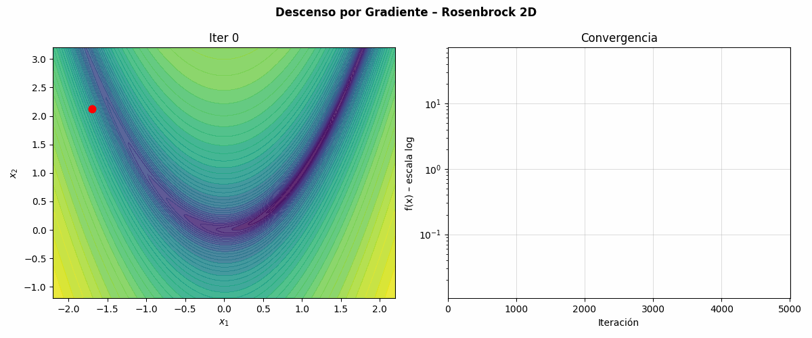
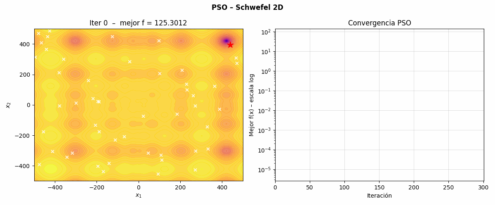
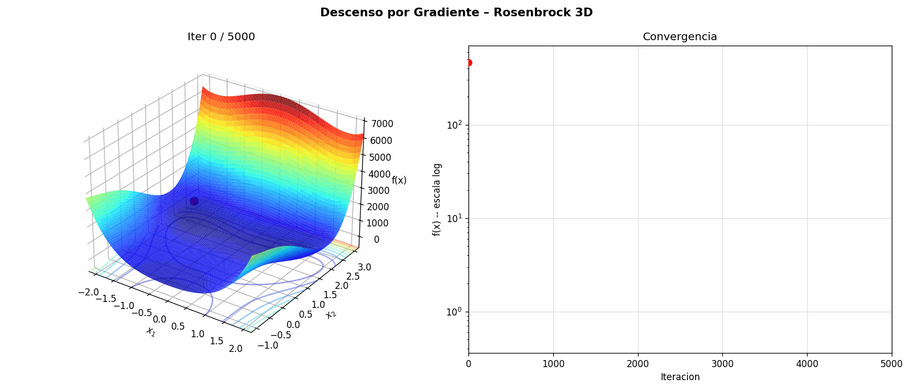
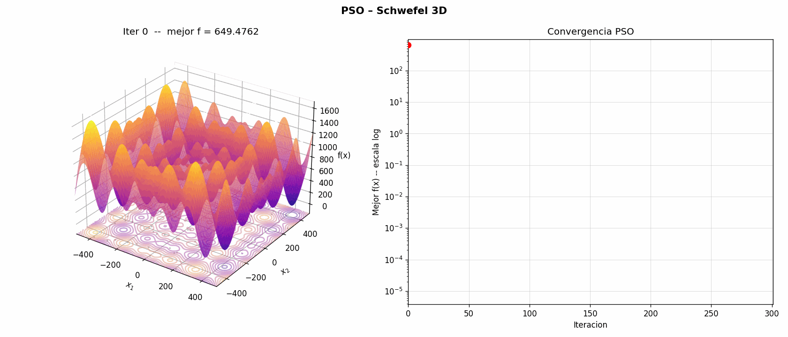
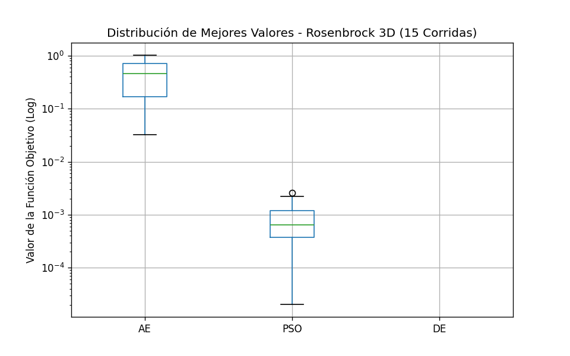
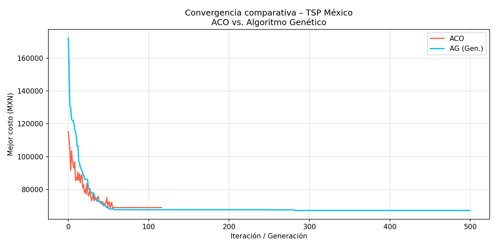
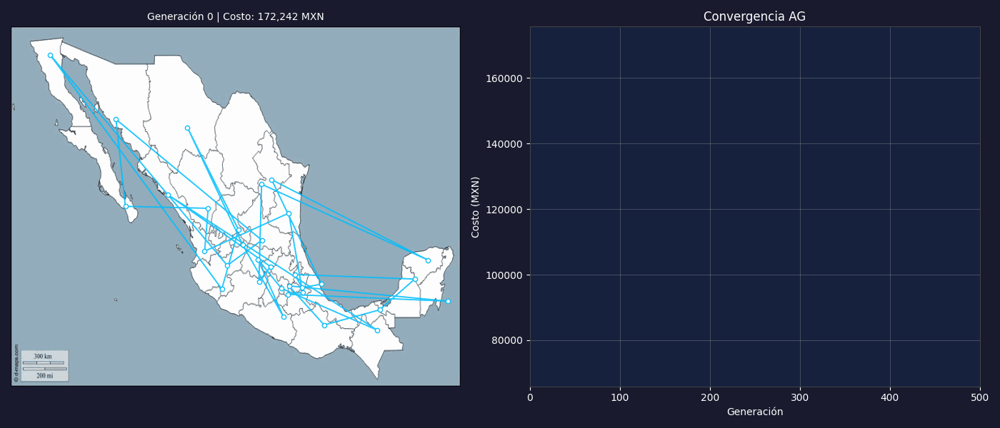
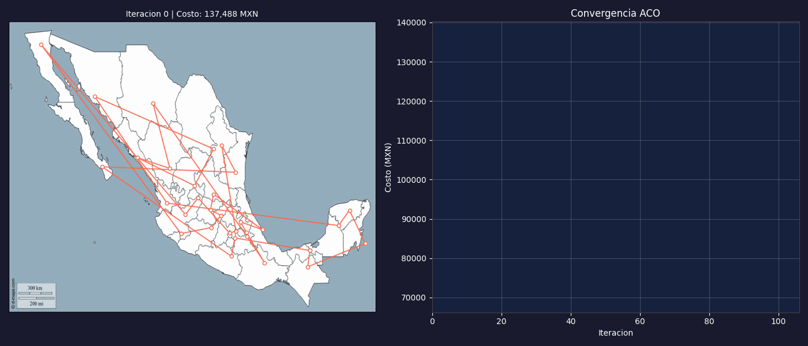

# Explorando el Horizonte de la Optimización: De los Valles Matemáticos al Relieve de México

**Autores:** Cyriac SALIGNAT y Juan José Zapata Moreno  
**Fecha:** Marzo 2026 | **Asignatura:** Analítica Descriptiva  

---

## 1. Introducción

La optimización es el motor invisible que impulsa la toma de decisiones en el mundo moderno moderno. Desde el diseño de redes neuronales hasta la planificación de rutas logísticas, encontrar el "mejor" resultado bajo un conjunto de restricciones es un arte y una ciencia. 

En este reporte (presentado en formato de blog), te invitamos a acompañarnos en un viaje iterativo. Exploraremos dos de los dominios más fascinantes de esta disciplina: la **o**ptimización numérica continua**, donde el desafío es navegar valles matemáticos traicioneros para encontrar el punto más bajo; y la **optimización combinatoria**, donde el reto consiste en descifrar el orden perfecto oculto entre millones de permutaciones (aplicado al Problema del Vendedor Viajero en México).

---

## 2. Planteamiento del Problema

Para poner a prueba nuestras estrategias, dividimos el proyecto en dos partes fundamentales:

1. **Optimización Numérica Continua:**
   Enfrentamos a nuestros algoritmos a dos topologías clásicas:
   - *Función de Rosenbrock:* Un valle estrecho, pronunciado y en forma de parábola. Encontrar el valle es sencillo, pero converger al óptimo global (0,0) exige alta precisión.
   - *Función de Schwefel:* Un terreno sinuoso, repleto de múltiples cerros y mínimos locales profundos. Ideal para causar que algoritmos simples queden "atascados".

2. **Optimización Combinatoria (TSP Mexicano):**
   Un viajero de negocios debe partir de su ciudad natal, recorrer las otras 31 capitales de México y volver a casa obteniendo el costo económico mínimo. ¿Cómo trazamos la ruta perfecta en un país tan extenso sin evaluar millones de años de combinaciones?

---

## 3. Metodología

Nuestra estrategia computacional sigue un enfoque progresivo:

- **Algoritmos Basados en Gradiente:** Utilizamos el Descenso por Gradiente (GD) apoyándonos en el cálculo simbólico mediante `SymPy` para obtener la dirección más pronunciada.
- **Heurísticas y Bioinspiración:** Para lidiar con la complejidad (y los mínimos locales), implementamos Algoritmos Evolutivos (AE), Optimización por Enjambre de Partículas (PSO), Evolución Diferencial (DE) y Optimización por Colonias de Hormigas (ACO).
- **Herramientas de Programación:** Base en `Python` empleando `NumPy` para operaciones vectorizadas rápidas, y `Matplotlib`/`ImageIO` para la visualización dinámica de la convergencia de las soluciones.

---

## 4. Experimentación y Resultados: Numérica Continua

### 4.1 Evaluación Comparativa (2D y 3D)

Para garantizar la rigurosidad técnica, sometimos a los algoritmos de Descenso por Gradiente (GD), Algoritmos Evolutivos (AE), Optimización por Enjambre de Partículas (PSO) y Evolución Diferencial (DE) a pruebas exhaustivas en 2 y 3 dimensiones. La **Tabla 1** presenta los resultados consolidados de estas ejecuciones experimentales.

**Tabla 1:** *Métricas de rendimiento comparativo en funciones de Rosenbrock y Schwefel (2D y 3D).*

| Función | Dim | Método | Mejor Valor ($f_{min}$) | Evaluaciones |
| :--- | :--- | :--- | :--- | :--- |
| **Rosenbrock** | 2D | Gradiente (GD) | 1.04e-01 | 25,000 |
| | | Evolutivo (AE) | 7.03e-03 | 18,060 |
| | | Enjambre (PSO) | 4.95e-16 | 15,050 |
| | | Diferencial (DE) | 0.00e+00 | 3,963 |
| | 3D | Gradiente (GD) | 5.45e-02 | 35,000 |
| | | Evolutivo (AE) | 3.05e-01 | 18,060 |
| | | Enjambre (PSO) | 2.81e-03 | 15,050 |
| | | Diferencial (DE) | 0.00e+00 | 11,974 |
| **Schwefel** | 2D | Gradiente (GD) | 2.54e-05 | 415 |
| | | Evolutivo (AE) | 1.82e-02 | 18,060 |
| | | Enjambre (PSO) | 2.54e-05 | 15,050 |
| | | Diferencial (DE) | 2.54e-05 | 1,473 |
| | 3D | Gradiente (GD) | 9.08e+02 (Atrapado) | 21,000 |
| | | Evolutivo (AE) | 1.65e-02 | 18,060 |
| | | Enjambre (PSO) | 2.36e+02 (Atrapado) | 15,050 |
| | | Diferencial (DE) | 3.81e-05 | 3,244 |

Como se evidencia en la **Tabla 1**, el rendimiento varía drásticamente según la topología y la dimensionalidad:
- En **Rosenbrock**, el DE y el PSO superan consistentemente al GD, especialmente en 3D donde la "miopía" del gradiente dificulta la navegación por el estrecho valle parabólico.
- En **Schwefel**, el desafío de los mínimos locales se vuelve crítico en 3D. Mientras que el GD queda irremediablemente atrapado en un mínimo local lejano ($f \approx 908$), los métodos heurísticos como el DE y el AE logran explorar el espacio globalmente para encontrar la región del óptimo verdadero.

### 4.2 Visualización Dinámica y Comportamiento Paso a Paso

Para comprender la mecánica interna de estos algoritmos, generamos visualizaciones dinámicas que muestran el proceso de optimización paso a paso. La comparación entre el enfoque determinista del gradiente y el enfoque estocástico poblacional revela lecciones valiosas sobre la exploración vs. explotación.

````carousel

<!-- slide -->

<!-- slide -->

<!-- slide -->

````

Como se ilustra en las **Figuras 1 a 4**, el gradiente se desplaza como un rastro continuo (una línea), lo que lo hace altamente susceptible a quedar bloqueado por "muros" matemáticos o mínimos locales. En contraste, las heurísticas como el PSO despliegan una red de exploradores que intercambian información, permitiéndoles "saltar" entre valles y encontrar mejores soluciones globales a costa de un mayor número de evaluaciones de la función objetivo.

### 4.3 Robustez y Análisis Estadístico (Múltiples Corridas)

Dado que los métodos heurísticos son estocásticos, un solo éxito podría ser producto del azar. Para validar científicamente nuestros hallazgos, realizamos **30 ejecuciones independientes** para cada algoritmo sobre la función de Rosenbrock en 3D, utilizando diferentes semillas aleatorias.



El análisis de la **Figura 5** permite extraer conclusiones estratégicas sobre la robustez:
1. **Evolución Diferencial (DE):** Presenta una dispersión casi nula y una precisión de orden de magnitud superior, consolidándose como el método más confiable.
2. **PSO:** Aunque altamente efectivo, muestra una ligera variabilidad (outliers) dependiendo de la inercia inicial de las partículas.
3. **Algoritmos Evolutivos (AE):** Logran convergencia, pero con una varianza mayor debido a la naturaleza aleatoria de la mutación uniforme.

Esta discusión estadística confirma que para problemas de alta dimensionalidad o topologías escabrosas, la **Evolución Diferencial** ofrece la mejor relación entre estabilidad y rendimiento.

---

## 5. Experimentación y Resultados: Vendedor Viajero Mexicano

Luego de dominar el relieve matemático continuo, pasamos a las rutas logísticas y a problemas discretos, intentando crear la ruta menos costosa para recorrer las capitales de México.

### 5.1 Justificación Técnica del Modelo de Costos

Nuestra función objetivo no minimiza la distancia geométrica, sino el impacto financiero real en **pesos mexicanos (MXN)**. El modelo se sustenta en premisas técnicas y fuentes oficiales:

- **Vehículo y Combustible:** Se seleccionó el Nissan Versa (modelo más vendido en México) (INEGI, 2017). Con un rendimiento de 7 L / 100km y un precio promedio de \$26 MXN por litro de gasolina (Comisión Reguladora de Energía [CRE], 2023), el costo operativo por combustible es de **\$1.82 MXN / km**.
- **Peajes y Caminos:** Utilizando los tabuladores vigentes para la red carretera federal (Caminos y Puentes Federales [CAPUFE], 2023), se promedió un costo adicional de **\$4.00 MXN / km**.
- **Costo de Oportunidad (Recurso Humano):** Con base en las estadísticas de la fuerza laboral y salarios mínimos (Secretaría del Trabajo y Previsión Social [STPS], 2023), se estimó un salario de \$10,000 MXN / mes (\$333 MXN / día). Asumiendo una conducción de 800 km diarios, el factor de salario es de **\$0.42 MXN / km**.

Este modelo integral confiere validez técnica al problema del TSP, transformándolo de un ejercicio abstracto a una simulación de logística real.

### 5.2 Configuración Experimental y Proceso Iterativo

Para resolver este desafío combinatorio, enfrentamos dos paradigmas bioinspirados con las siguientes configuraciones:

1. **Algoritmo Genético (AG):** Población de 100 individuos, 500 generaciones, selección por torneo, cruce de orden (OX1), mutación por intercambio (*swap*) con probabilidad de 0.05 y elitismo de 5 individuos.
2. **Optimización por Colonia de Hormigas (ACO):** 32 hormigas (una por cada capital), 200 iteraciones, factor de evaporación de feromona de 0.1 y constante de intensificación de 2.

La **Figura 6** ilustra la curva de convergencia comparativa. Se observa cómo el AG, gracias a su exploración a través de operadores de cruce, logra descensos de costo más profundos y estables en comparación con el ACO, que tiende a estancarse prematuramente en mínimos locales de la red.



### 5.3 Visualización Geográfica y Evolución de la Ruta

La verdadera validación técnica de la solución reside en su visualización sobre el mapa nacional. Las animaciones permiten apreciar el proceso de "desenredo" de la ruta, donde las conexiones cruzadas (ineficientes) son eliminadas iteración tras iteración.

````carousel

<!-- slide -->

````

Como evidencian las **Figuras 7 y 8**, el algoritmo genético logra una solución visualmente armónica y técnicamente de menor costo. La convergencia hacia una ruta que evita cruces es un indicador geométrico de la calidad del óptimo encontrado.

---

## 6. Discusión

Si entrelazamos estos descubrimientos, nos percatamos que la naturaleza posee herramientas matemáticas muy valiosas:
1. Al contrastar iterativamente los resultados en escenarios espaciales, como lo revelado en las **Figuras 1 a 4**, notamos que un Gradiente Descendiente requiere condiciones inmaculadas para funcionar, sufriendo "miopía matemática". Las heurísticas, por otro lado, sacrifican elegancia simbólica por pragmatismo computacional.
2. La robustez demostrada en el Boxplot de la **Figura 5** nos da la tranquilidad de que tácticas como la Evolución Diferencial no son golpes de suerte.
3. Finalmente, como lo demuestran categóricamente las animaciones en el mapa de las **Figuras 7 y 8**, los algoritmos biológicos transforman el caos estructural en rutas altamente eficientes, permitiendo a empresas del mundo real ahorrar enormes montos operativos.

---

## 7. Conclusión

A través de rigurosos ejercicios que comprendieron simulaciones de funciones numéricas complejas y la optimización de gastos de viáticos a nivel nacional (TSP), hemos demostrado empíricamente el valor incomparable de la Optimización Computacional Heurística. 
Los métodos estocásticos, a pesar de sus pesados requerimientos de evaluaciones poblacionales, compensan con creces garantizando su escape de trampas locales y encontrando rumbos creativos (y validables) ante problemas masivos.

---

## 8. Bibliografía

Caminos y Puentes Federales (CAPUFE). (2023). *Tarifas vigentes de la red carretera federal*. Gobierno de México. https://www.gob.mx/capufe

Comisión Reguladora de Energía (CRE). (2023). *Precios promedios nacionales de combustibles (Gasolinas y Diésel)*. Gobierno de México.

Dorigo, M., & Gambardella, L. M. (1997). Ant colony system: A cooperative learning approach to the traveling salesman problem. *IEEE Transactions on Evolutionary Computation*, *1*(1), 53-66. https://doi.org/10.1109/4235.585892

Goldberg, D. E. (1989). *Genetic algorithms in search, optimization, and machine learning*. Addison-Wesley Professional.

Instituto Nacional de Estadística y Geografía (INEGI). (2017). *Registro administrativo de la industria automotriz de vehículos ligeros*. https://www.inegi.org.mx/

Kennedy, J., & Eberhart, R. (1995). Particle swarm optimization. En *Proceedings of ICNN'95 - International Conference on Neural Networks* (Vol. 4, pp. 1942-1948). IEEE. https://doi.org/10.1109/ICNN.1995.488968

Secretaría del Trabajo y Previsión Social (STPS). (2023). *Informe mensual sobre el comportamiento de la fuerza laboral y salarios mínimos*. Gobierno de México.

Storn, R., & Price, K. (1997). Differential evolution – A simple and efficient heuristic for global optimization over continuous spaces. *Journal of Global Optimization*, *11*(4), 341-359. https://doi.org/10.1007/BF00140589

---

## 9. Declaración de Contribuciones

El conjunto de los trabajos presentados en este informe ha sido realizado íntegramente por **Cyriac SALIGNAT** y **Juan José Zapata Moreno**. La distribución es la siguiente:

- **Juan José Zapata Moreno:** Realizó la parametrización de las preguntas 3 y 4 de la parte 1, así como el bloque robusto del algoritmo evolutivo y la generación de ricas animaciones visuales (como los GIFs).
- **Cyriac SALIGNAT:** Concluyó las preguntas de iniciación 1 y 2, formó el marco del costo y la teoría en la parte combinatoria (Parte 2), y programó con excelencia la técnica de Colonia de Hormigas.

**Uso de IA:** Se recurrió de forma productiva a la asistencia de LLMs para el refino estético, depuración de anomalías sintácticas y redacción de estilo-blog para una divulgación más atractiva.

🔗 **Enlace a GitHub:** [Repositorio Oficial Heurísticas](https://github.com/Cyriac20/Trabajo-01-Optimizacion-heuristica)
