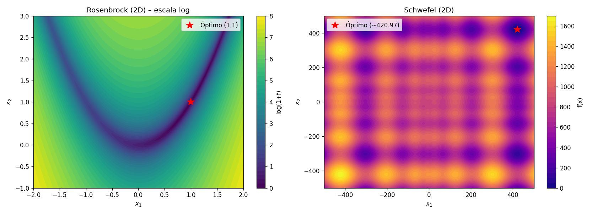
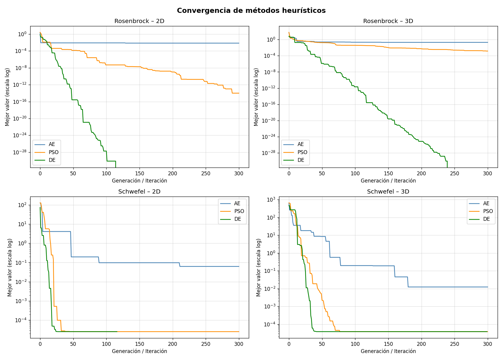
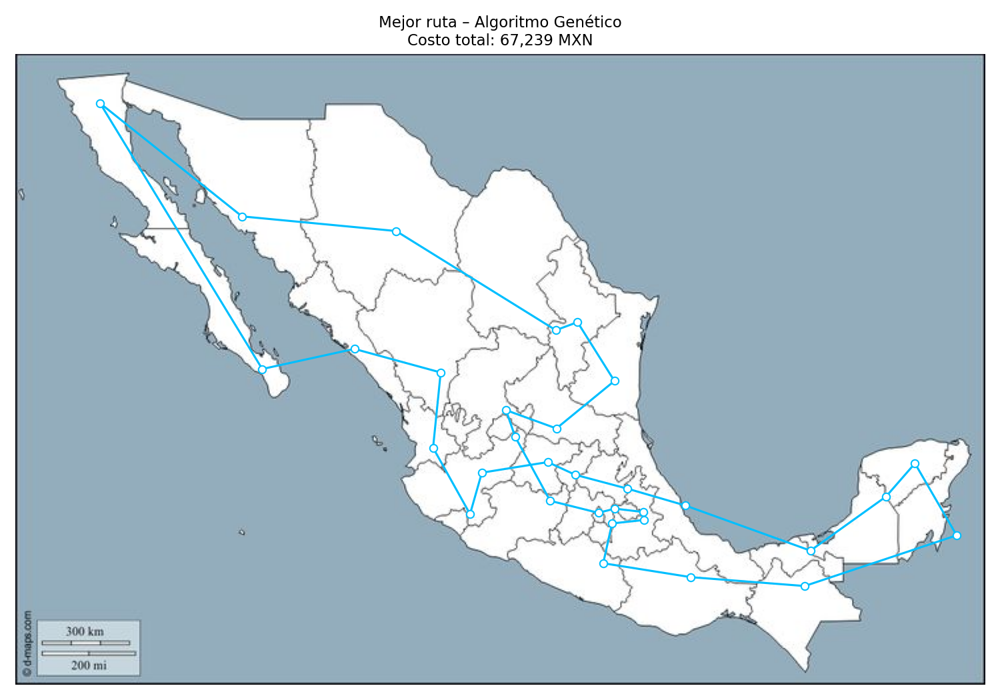
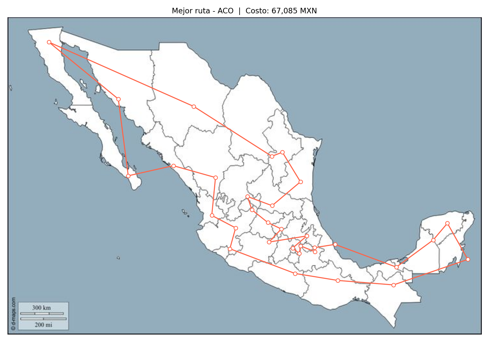

# Explorando el horizonte de la optimización: de los valles matemáticos al relieve de México

**Autores:** Cyriac SALIGNAT y Juan José Zapata Moreno  
**Asignatura:** Analítica Descriptiva  
**Repositorio:** <https://github.com/Cyriac20/Trabajo-01-Optimizacion-heuristica>

## 1. Introducción

Este reporte presenta un trabajo de optimización dividido en dos partes. En la primera se comparan métodos de optimización continua sobre funciones de prueba clásicas. En la segunda se resuelve una versión del Problema del Vendedor Viajero sobre las 32 capitales de los estados de México, usando costos económicos y no solo distancia.

El reporte final en formato blog visual está disponible en `reporte-tecnico-blog.html`. Este Markdown funciona como fuente editable y guía de trazabilidad para la entrega.

## 2. Planteamiento del problema

En la Parte 1 se seleccionaron dos funciones de prueba: Rosenbrock y Schwefel. Ambas se optimizaron en dos y tres dimensiones usando descenso por gradiente con condición inicial aleatoria, algoritmo evolutivo, optimización por enjambre de partículas (PSO) y evolución diferencial (DE).

En la Parte 2 se formuló un TSP sobre las 32 capitales mexicanas. La función objetivo minimiza el costo total del recorrido, calculado como suma de combustible, peajes y valor del tiempo del vendedor.

## 3. Metodología numérica

Las funciones seleccionadas fueron:

- **Rosenbrock:** \( f(\mathbf{x}) = \sum_{i=1}^{d-1} [100(x_{i+1}-x_i^2)^2 + (1-x_i)^2] \), con óptimo global en \( \mathbf{x}=(1,\dots,1) \) y valor 0.
- **Schwefel:** \( f(\mathbf{x}) = 418.9829d - \sum_{i=1}^{d} x_i\sin(\sqrt{|x_i|}) \), con óptimo aproximado en \(x_i=420.9687\).

Los experimentos se ejecutaron en `notebooks/Parte1_Optimizacion_Heuristica.ipynb`. La comparación incluye valor final de la función objetivo, número de evaluaciones y múltiples corridas independientes para observar robustez.

## 4. Resultados numéricos y visualizaciones

La Figura 1 muestra las superficies 2D de Rosenbrock y Schwefel.

Las animaciones generadas para descenso por gradiente son:

- `resultados/gd_rosenbrock_2D.gif`
- `resultados/gd_rosenbrock_3D.gif`
- `resultados/gd_schwefel_2D.gif`
- `resultados/gd_schwefel_3D.gif`

Las animaciones generadas para métodos heurísticos son:

- `resultados/ae_rosenbrock_2D.gif`
- `resultados/ae_schwefel_2D.gif`
- `resultados/pso_rosenbrock_2D.gif`
- `resultados/pso_rosenbrock_3D.gif`
- `resultados/pso_schwefel_2D.gif`
- `resultados/pso_schwefel_3D.gif`

La Figura 2 resume la convergencia de los métodos heurísticos.

La Figura 3 presenta el boxplot de múltiples corridas independientes.

En Rosenbrock, el descenso por gradiente sirve como referencia local y puede aproximarse al óptimo, pero su avance es sensible al ajuste de tasa de aprendizaje. En Schwefel, el gradiente queda atrapado con facilidad en mínimos locales. DE y PSO presentan mejor robustez porque exploran varias regiones del espacio de búsqueda; DE fue el método más consistente en los escenarios comparados.

## 5. Metodología combinatoria: TSP mexicano

El TSP se implementó con dos métodos:

- **Algoritmo genético:** población de rutas, selección por torneo, cruce OX, mutación por intercambio y elitismo.
- **Colonia de hormigas:** construcción probabilística de rutas con feromonas, evaporación e intensificación.

La distancia entre capitales se estimó con la fórmula de Haversine y un factor de corrección de 1.2 para aproximar desplazamiento por carretera. El costo por kilómetro se calculó como:

\[
c_{\text{total}} = c_{\text{combustible}} + c_{\text{peaje}} + c_{\text{tiempo}}
\]

Con los parámetros actualizados y documentados en el código:

- Combustible: se usó un consumo conservador de \(7\text{ L}/100\text{ km}\). Con el precio nacional de gasolina regular reportado por Profeco con información de CRE para noviembre de 2024, \(23.96\text{ MXN/L}\), el componente queda en \(1.677\text{ MXN/km}\).
- Peajes: CAPUFE publica tarifas oficiales por plaza y tramo, no un único costo nacional por kilómetro. Por eso se conserva \(4.00\text{ MXN/km}\) como parámetro efectivo de escenario para representar uso de red de cuota dentro del modelo simplificado.
- Tiempo del vendedor: se tomó como referencia la remuneración promedio mensual nacional de \(14,056\text{ MXN}\) reportada en la minimonografía de los Censos Económicos 2024 del INEGI. Al dividir entre 30 días y asumir \(800\text{ km/día}\), el componente de tiempo es \(0.586\text{ MXN/km}\).
- Costo total aproximado: \(1.677 + 4.000 + 0.586 = 6.263\text{ MXN/km}\).

Este ajuste refuerza la trazabilidad sin alterar la interpretación central de los resultados: el objetivo sigue siendo minimizar costo económico, y el factor dominante continúa siendo la combinación distancia-peaje.

## 6. Resultados del TSP

La Figura 4 muestra la ruta final obtenida con el algoritmo genético.

La Figura 5 muestra la ruta final obtenida con colonia de hormigas.

Las animaciones geográficas están en:

- `resultados/gif_ruta_ag.gif`
- `resultados/gif_ruta_aco.gif`

La Figura 6 compara la convergencia de AG y ACO.

El algoritmo genético mantuvo diversidad durante más generaciones y alcanzó una ruta de menor costo en las corridas documentadas. ACO mejoró rápidamente al inicio, pero tendió a estancarse cuando la feromona se concentró en una solución subóptima.

## 7. Discusión general

El descenso por gradiente aportó interpretabilidad y precisión local. Su trayectoria muestra cómo la pendiente guía la solución, pero también evidencia su fragilidad frente a mínimos locales.

Los métodos heurísticos aportaron exploración, diversidad y robustez. En la Parte 1 permitieron encontrar mejores soluciones en Schwefel; en la Parte 2 hicieron viable el TSP sin enumerar las \(32!\) rutas posibles.

La conclusión técnica es que el método debe elegirse según la topología del problema: el gradiente es adecuado para explotación local en superficies suaves; las heurísticas son preferibles cuando el paisaje es multimodal, discreto o combinatoriamente grande.

## 8. Uso de IA

La IA se usó como soporte de organización, planeación y revisión del trabajo, no como sustituto del desarrollo experimental. Su aporte principal fue ayudar a convertir la retroalimentación del profesor en un plan de acción verificable, revisar qué requisitos seguían faltando, ordenar los documentos del repositorio y mejorar la presentación del reporte técnico en formato blog.

También se utilizó para proponer una estructura más clara del HTML, mejorar la rotulación de figuras y tablas, revisar la coherencia entre código, resultados y discusión, y sugerir cómo documentar el modelo de costos con fuentes para combustible, peajes y salario. En la etapa final ayudó a hacer una auditoría del repositorio: README, checklist de mejoras, verificación de entrega, bibliografía y trazabilidad de archivos generados.

Los prompts principales fueron:

- "Verifica este proyecto contra la retroalimentación del profesor y dime qué falta para cumplir todos los requisitos".
- "Ayúdame a crear un plan de acción para mejorar la entrega y organizar los documentos del repositorio".
- "Revisa si el reporte evidencia 2D y 3D, múltiples corridas, GIFs, modelo de costos y bibliografía APA".
- "Ayúdame a mejorar el diseño del reporte HTML/blog y la presentación de figuras, tablas y resultados".
- "Propón una explicación clara del modelo de costos para el TSP mexicano con combustible, peajes y salario".
- "Ayúdame a dejar el README y la estructura del repositorio más presentables para GitHub".

Impacto: la IA ayudó principalmente a planificar cambios, encontrar vacíos frente a la rúbrica, mejorar la estructura narrativa y visual del reporte, y ordenar la entrega final. Las implementaciones, resultados y archivos generados se mantienen trazables en el notebook, scripts y carpeta `resultados/`.

## 9. Contribución individual

- **Juan José Zapata Moreno:** contribuí a la parametrización de los experimentos de la Parte 1, al bloque del algoritmo evolutivo y a la generación de visualizaciones GIF.
- **Cyriac SALIGNAT:** contribuí al planteamiento de las funciones, al modelado del costo del TSP y a la implementación de colonia de hormigas.

**Video de contribución individual:** entregado por separado.

## 10. Bibliografía

Caminos y Puentes Federales de Ingresos y Servicios Conexos. (2024). *Tarifas vigentes 2024 de la red FONADIN y red operada por CAPUFE*. Gobierno de México. https://pot.capufe.mx/gobmx/Transparencia/Doc/TransparenciaF/Tarifas/Vigentes/2024/Tarifas-Vigentes-2024.pdf

Dorigo, M., & Gambardella, L. M. (1997). Ant colony system: A cooperative learning approach to the traveling salesman problem. *IEEE Transactions on Evolutionary Computation, 1*(1), 53-66.

Goldberg, D. E. (1989). *Genetic algorithms in search, optimization, and machine learning*. Addison-Wesley.

Kennedy, J., & Eberhart, R. (1995). Particle swarm optimization. *Proceedings of ICNN'95 - International Conference on Neural Networks*, 1942-1948.

Instituto Nacional de Estadística y Geografía. (2024). *Censos Económicos 2024: Minimonografía nacional*. INEGI. https://www.inegi.org.mx/contenidos/programas/ce/2024/doc/ce2024_mn00.pdf

Procuraduría Federal del Consumidor. (2024). *Quién es quién en los precios de la gasolina: precios promedio diarios de gasolina regular, premium y diésel*. Gobierno de México. https://combustibles.profeco.gob.mx/qqpgasolina/2024/QQPGASOLINA_120224.pdf

Rosenbrock, H. H. (1960). An automatic method for finding the greatest or least value of a function. *The Computer Journal, 3*(3), 175-184.

Schwefel, H.-P. (1981). *Numerical optimization of computer models*. John Wiley & Sons.

Sinnott, R. W. (1984). Virtues of the Haversine. *Sky and Telescope, 68*(2), 158.

Storn, R., & Price, K. (1997). Differential evolution: A simple and efficient heuristic for global optimization over continuous spaces. *Journal of Global Optimization, 11*(4), 341-359.
